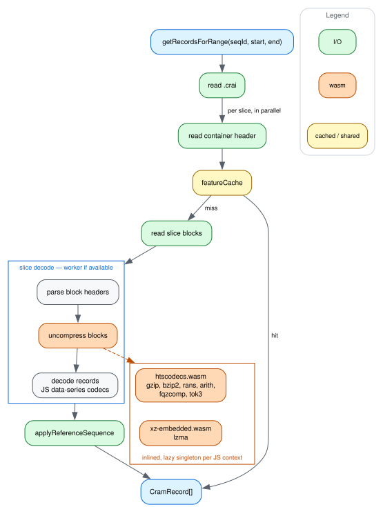

# How a query flows

[dataflow.dot](img/dataflow.dot) is the source; see
[CONTRIBUTING.md](../CONTRIBUTING.md) for how to re-render it.

A query turns its range into a list of `.crai` slice entries, and from there
every slice runs in parallel. Each slice:

- **Resolves its container** — the header and compression header block, memoized
  for the query, since a container holds several slices.
- **Asks `featureCache` for the decoded records.** A hit returns them already
  decoded and already decorated with their reference, so a repeat query pays
  only the filter.
- **On a miss, reads the whole block region in one go and decodes it:** walk the
  blocks, decompress each by its method byte, build the per-slice decode
  context, then make one pass over the records into the read-feature arena and
  the tag and quality columns.

Why each of those steps looks the way it does, and what measured it, is
[optimizations.md](optimizations.md).

The diagram draws the main path only. It leaves out:

- the file definition and SAM header — file-wide memos that every query after
  the first joins already resolved;
- non-indexed access through `CramFile` directly, which walks containers and
  reads blocks one at a time;
- the mate pass re-entering the index and the cache for slices it did not
  already have;
- cache eviction, which is LRU plus an idle sweep.

## What the decode writes into

The record pass does not build `{code, pos, refPos, data}` objects. Instead it
writes:

- **read features into a per-slice arena** — struct-of-arrays typed columns,
  with each record holding a start and a count into them;
- **tags and quality scores into columns of their own;**
- **the per-record scalars into one `Int32Array`**, eighteen slots a record.

Together those are a `DecodedSlice`, and a `CramRecord` is a view onto one index
of it — there is no per-record object anywhere between the file and the cache.

Read features dominate decoded-record memory on long reads (a 37-record ONT
slice decodes 213k of them), and 15 bytes of columns per feature against 64 per
object decides whether a slice fits in the cache at all.

That shape is load-bearing for the two steps after it:

- **The arena sizes itself up front** from the slice's own blocks rather than
  growing, since reallocating seven columns is where a long-read slice spends
  its decode time.
- **Typed arrays let a worker transfer the result at zero copy** instead of
  structured-cloning an object graph, and the host uses it as it lands rather
  than rebuilding anything per record.

[memory.md](memory.md#columns-not-objects) has the per-column costs,
[read-features.md](read-features.md) how to read them without materializing
anything.

## Where the slice decode happens

Everything in the purple box runs on a **worker pool** when the host has one — a
`Worker` from a Blob URL, both of them inlined, so there is nothing to
configure. One pool serves the whole JS context, as in
[bam-js](https://github.com/GMOD/bam-js/blob/main/docs/dataflow.md), but the
unit is the **whole slice** rather than just decompression: block decompression
accounts for only 24–35% of a cold query, so a decompression-only pool caps out
around 1.33x where this measures 2.0–3.6x. That is why the diagram draws a box
around several steps here and bam's draws a single node. Anything that cannot
start a pool decodes in-process instead — the same code, on the thread that
asked.

Two things stay on the main thread whatever happens:

- **Describing the slice to the worker as bytes and numbers only.** A `CramFile`
  holds a filehandle and your `fetchReferenceSequence` callback, neither of
  which can travel; coming back, the columns transfer at zero copy rather than
  cloning.
- **`applyReferenceSequence`**, because resolving substitutions means calling
  that callback.

[workers.md](workers.md) has the measurements and the fallbacks.

## Where wasm sits

Everything orange is wasm:

- **`htscodecs.wasm`** handles gzip (through libdeflate), bzip2, and every CRAM
  codec from rANS to fqzcomp and tok3.
- **A second `xz-embedded.wasm`** handles lzma, which htscodecs has no codec for
  at all.

The build inlines both, and each instantiates lazily, once per JS context. The
`.crai` goes through wasm too, though the diagram does not draw that edge — the
index is gzipped, so the first wasm call of a session is usually gunzipping it
rather than decompressing a block.

The code crosses the boundary **once per block, never per record**: each
crossing copies its input into the wasm heap and its output back out, and a
block's two copies amortize over the thousands of records in it. Everything
above the block — the data-series codecs, the record decode, the columns — is JS
reading bytes that already sit in the JS heap. [wasm.md](wasm.md) has the rest
of that argument, and [codec-support.md](codec-support.md) the codec list.
